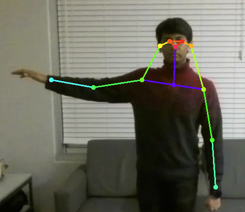
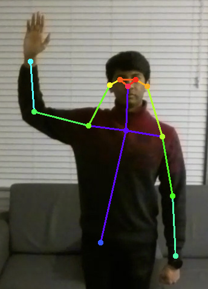
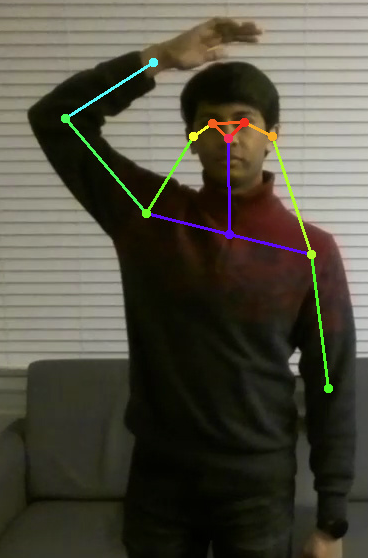
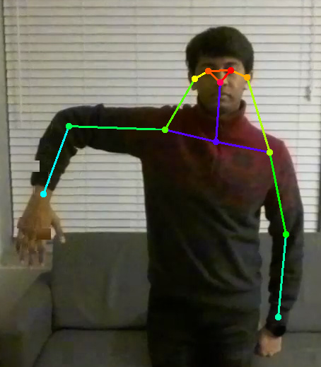

# HandSign-Drone

Based on certain hand signs, the drone will react accordingly. The hand signs are detected by a video stream that a [Tello EDU Drone](https://www.ryzerobotics.com/tello-edu) sends to the [NVIDIA Jetson](https://developer.nvidia.com/embedded/jetson-nano-developer-kit).

This program is capable of the following actions:
- Rotate counter-clockwise (Arm Extended)

- Rotate clockwise (Arm Angled Up)

- Do a flip (Pat on head)

- Land (Arm Angled Down)

## Prerequisites
- [Tello EDU Drone](https://www.ryzerobotics.com/tello-edu)
- [NVIDIA Jetson](https://developer.nvidia.com/embedded/jetson-nano-developer-kit)
- [Python 3.6](https://www.python.org/downloads/release/python-360/)
- [USB Wi-Fi Adapter](https://www.amazon.com/TP-Link-wireless-network-Adapter-SoftAP/dp/B008IFXQFU/ref=sr_1_3)
- [NVIDIA Jetson Inference Project](https://github.com/dusty-nv/jetson-inference/blob/master/docs/building-repo-2.md#quick-reference)
  - Follow the instructions under the "Quick Reference" section by running all the commands in the code block one by one in the Jetson's terminal.
- [H264Decoder](https://github.com/robagar/h264decoder?tab=readme-ov-file#linux)
  - Follow the instructions listed under the Linux section of the README.md file.
  - You will likely need to run `sudo apt-get install python3-setuptools` before you can run `pip install .`.
- [Tello AsyncIO](https://github.com/robagar/tello-asyncio)
  - Run `pip3 install tello-asyncio` to install this package.
  - Once installed, replace all contents of the `/home/user/.local/lib/python3.6/site-packages/tello_asyncio` (where `user` is your username) with the contents of the `python_packages/tello_asyncio` folder in this repository.
- [Tello AsyncIO Video](https://github.com/robagar/tello-asyncio-video)
  - Clone the repository and run `pip install .` to install package.
  - Once installed, replace all contents of the `/home/user/.local/lib/python3.6/site-packages/tello_asyncio_video` (where `user` is your username) with the contents of the `python_packages/tello_asyncio_video` folder in this repository.
- [Jetson Tello](https://github.com/robagar/jetson-tello)
  - You may need to run `pip install numpy` before you install this package.
  - Clone the repository and run `pip install .` to install package.
  - Once installed, replace all contents of the `/home/user/.local/lib/python3.6/site-packages/jetson_tello` (where `user` is your username) with the contents of the `python_packages/jetson_tello` folder in this repository.

## Running the Program
1. Plug in the USB Wi-Fi adapter into the Jetson.
2. Connect the Jetson to the Tello's Wi-Fi network.
   - This can be done by running `sudo nmcli dev wifi connect TELLO-XXXXXX` in the terminal, where `TELLO-XXXXXX` is the name of the Tello's Wi-Fi network name. Run `sudo nmcli dev wifi` to see the list of available Wi-Fi networks and find the one that corresponds to your drone.
3. Run `python3 handSignDetection.py` in the terminal and watch your drone take off and perform actions based on your hand signs!